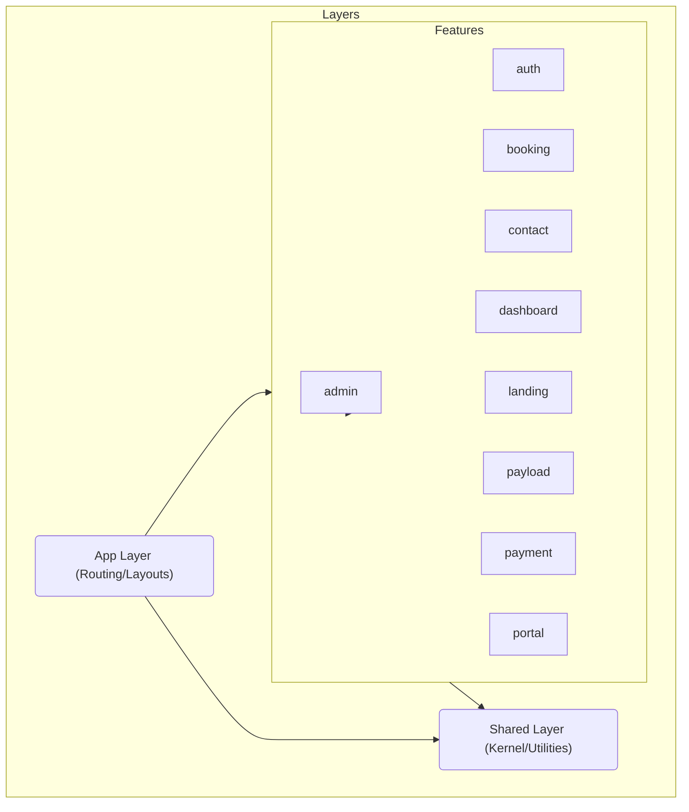

# System Architecture

## Overview
The Mobile Garage Door application follows a **Feature-Sliced Design (FSD)** architecture to ensure scalability, maintainability, and clear separation of concerns.

## Directory Structure
The codebase is organized into the following layers:



## Key Components

### 1. Feature Layer (`src/features`)
Contains distinct functionality domains. Each feature folder should ideally contain its own components, hooks, and types.

*   **Admin**: Back-office management for projects, services, users, and content.
*   **Auth**: Authentication flows (Magic Links, Clerk/NextAuth usage).
*   **Booking**: The multi-step wizard for scheduling repairs.
*   **Dashboard**: The customer and technician command centers.
*   **Payload**: Custom components for the Payload CMS admin panel.
*   **Portal**: Customer-facing portal for viewing service history.

### 2. Shared Layer (`src/shared`)
Contains reusable code used across multiple features.

*   `src/shared/ui`: Generic UI components (Buttons, Inputs, Modals).
*   `src/shared/lib`: Helper functions, constants, and utilities.

### 3. App Layer (`src/app`)
Next.js App Router structure. Acts as the entry point and composition layer, importing widgets from `features` and sticking them together.

## Integrations

```mermaid
flowchart LR
    Client[Next.js Client] --> Proxy[Realtime Proxy (Cloudflare)]
    Client --> API[Next.js API Routes]
    Client --> Square[Square Payments]
    
    API --> Payload[Payload CMS]
    API --> Postgres[(Postgres DB)]
    API --> SES[AWS SES (Email)]
    
    Proxy --> OpenAI[OpenAI Realtime API]
```

## Legacy & Reference
*   **Lex Bot**: Documentation for the AWS Lex integration is available in `doc/archive/AWS_LAMBDA_FUNCTION.js`.
*   **Email Strategy**: See `doc/EMAIL_ARCHITECTURE.md`.
