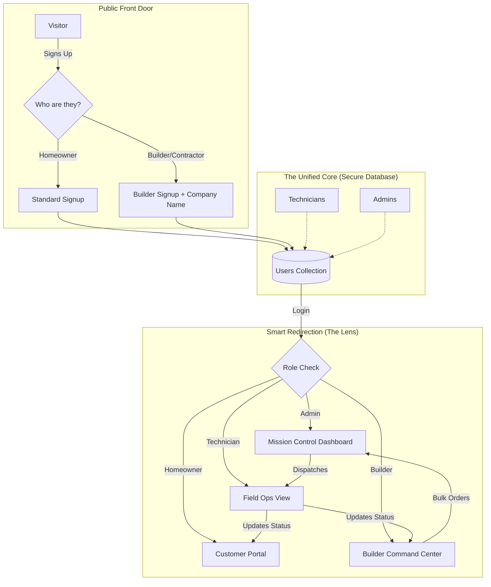
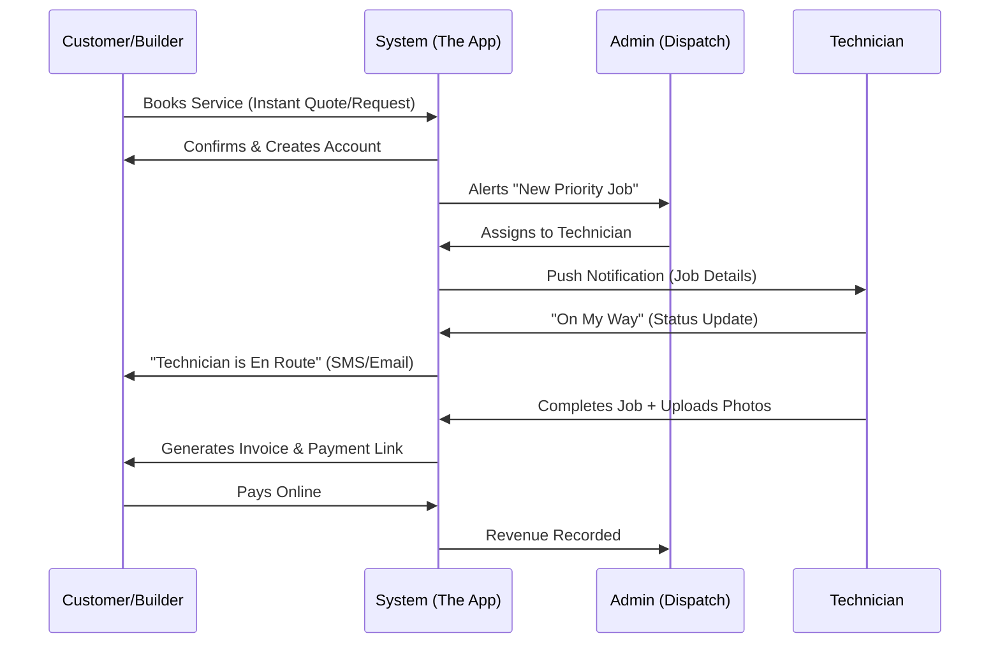
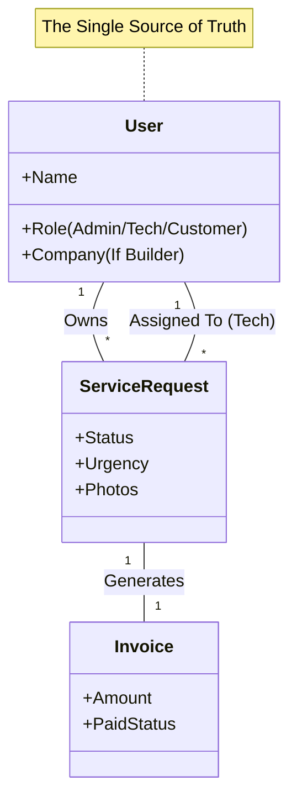

# Client Presentation Resources

Use these diagrams and prompts to articulate the value of the custom software to your client.

## 1. The "Unified Command" Architecture (Mermaid)

This diagram explains how the system handles different types of users (Homeowners, Builders, Technicians, Admins) using a single, secure core. This creates a seamless experience where data flows instantly between parties.

## 2. The Service Lifecycle (Value Stream)

This shows how the software accelerates the business process from "I have a problem" to "Paid & Fixed".

## 3. The "Why Custom?" Data Advantage

This explains why this is better than using 5 different apps (Excel, QuickBooks, Calendly, etc.).

---

## AI Image Generation Prompts (Visualizing the Value)

Use these prompts in tools like Midjourney, DALL-E 3, or Adobe Firefly to create visuals for your client presentation.

### Visual 1: The "Builder Command Center"
**Concept:** Show a busy contractor easily managing jobs on a tablet at a construction site.
**Prompt:**
> "A realistic, high-quality photo of a construction site manager in a hard hat and safety vest, standing in front of a framed house structure. He is holding a modern tablet displaying a clean, professional dashboard app with a dark blue and gold color scheme. The screen shows a list of 'Active Jobs' and 'Scheduled Installations'. The lighting is golden hour sunlight. Cinematic depth of field, 8k resolution, professional photography style."

### Visual 2: The "Technician Field Ops"
**Concept:** A technician receiving a job alert in their van.
**Prompt:**
> "A close-up shot inside a work van, looking over the shoulder of a service technician. He is holding a smartphone showing a 'New Job Alert' map interface with a 'Accept Job' button. The app interface is modern, dark mode, with high contrast buttons. Through the windshield, a suburban driveway with a garage door is visible. The mood is efficient and high-tech. 4k, hyper-realistic."

### Visual 3: The "Peace of Mind" Homeowner
**Concept:** A homeowner relaxing while tracking their technician.
**Prompt:**
> "A photo of a homeowner relaxing on a living room sofa with a cup of coffee, looking at a smartphone. The phone screen shows a tracking map with a small truck icon and text 'Technician Arriving in 5 Mins'. The background is a cozy, modern living room. The image conveys relief, convenience, and trust. Soft, natural lighting."

### Visual 4: The "All-Seeing" Admin Dashboard
**Concept:** The business owner seeing everything at once.
**Prompt:**
> "A wide shot of a modern home office desk. On the monitor, a comprehensive 'Mission Control' dashboard is visible. It shows a map with live truck locations, a revenue graph climbing upward, and a list of recent bookings. The aesthetic of the software is 'Dark Mode' with neon gold and blue accents. The desk is clean, suggesting organization and control. High-tech, futuristic business vibe."

---

## AI Text Prompts (Copywriting)

Use these prompts to generate marketing copy, client explanations, or manuals.

### Prompt 1: Explaining the "Builder VIP" Experience
> "Write a persuasive email to local construction companies and contractors introducing our new 'Builder Command Center'. Explain that unlike other garage door companies where they have to call and wait on hold, our portal gives them a dedicated dashboard to book jobs for multiple sites, track status in real-time, and access commercial pricing. The tone should be professional, efficient, and emphasize 'saving them time'."

### Prompt 2: The "Technician Field Ops" Pitch (For Internal Buy-in)
> "Explain the value of our new 'Field Ops Dashboard' to a non-technical field technician. Focus on how it makes their day easier: no more paper tickets, instant address mapping, seeing exactly what the customer complained about before arriving, and being able to mark jobs complete with one tap. Use a friendly, 'partner-in-crime' tone."

### Prompt 3: The "Peace of Mind" Pitch (For Homeowners)
> "Write a section for our website's 'Why Choose Us' page titled 'The Smart Garage Experience'. Explain that when they book with us, they get a secure portal where they can see their technician's status, view history, and pay invoices safely. Contrast this with the 'old way' of waiting for a callback and writing paper checks. Make it sound modern, secure, and hassle-free."

### Prompt 4: The "All-in-One" Business Value (For the Client/Owner)
> "Summarize the business value of this custom software for the business owner. Highlight three key pillars: 1. **Operational Efficiency** (Automated dispatching and role-based dashboards reduce phone tag), 2. **Revenue Growth** (Builder portal attracts high-volume B2B clients), and 3. **Professionalism** (A slick, branded portal makes the company look like a major national player). Keep it encouraging and visionary."
