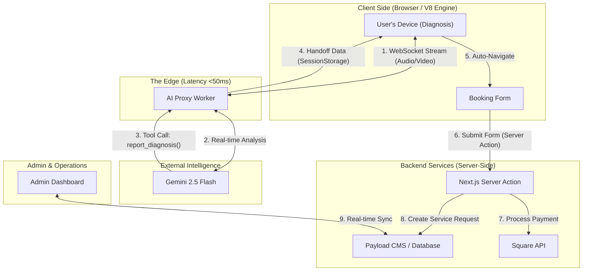
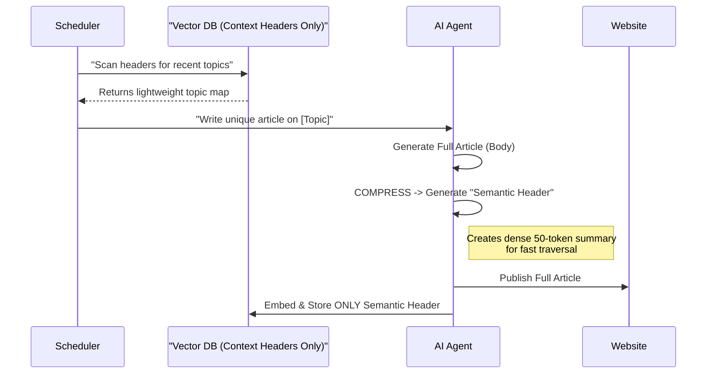
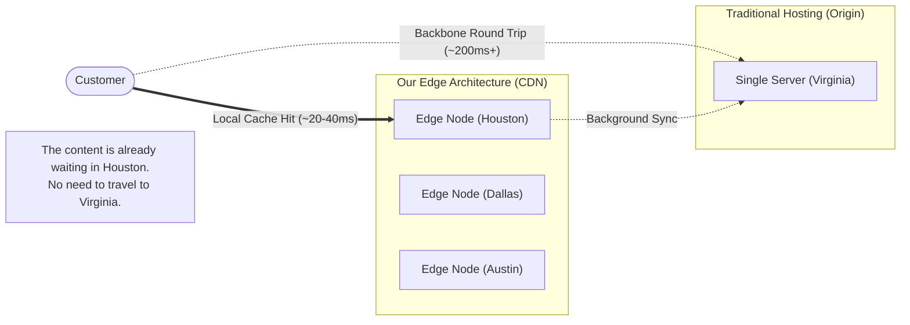

# Technical Architecture & Workflows

**For:** Technical Review / Development Roadmap
**Overview:** Detailed breakdown of the "Edge-First" infrastructure and AI data flows.

---

## 1. User Journey: The AI Diagnosis Pipeline
*How data moves from the customer's camera to your dashboard securely and instantly.*

---

## 2. The Growth Engine: Autonomous SEO Loop
*How the system writes unique content using Vector Memory to avoid duplication.*

**Key Innovation: The "Semantic Header" Strategy**
Instead of storing the entire article (which is slow to search), we generate a **Compressed Context Header**—a dense, 50-token summary of the article's core meaning (similar to a network packet header).
*   **Speed:** The Vector DB traverses these tiny headers instantly.
*   **Novelty:** The AI checks against these headers to ensure it never writes the same article twice.

---

---

## 3. Smart Caching Strategy (The "Time Travel" Layer)
*How we make the site feel instant for 99% of visitors.*

**The Real Bottleneck: distance + "The Messy Internet"**
A theoretical fiber line from Houston to Ashburn is ~40ms. But on real 4G/5G/Wi-Fi with ISP routing? It's often **150ms - 300ms** just to start receiving data.

**Our Solution: Aggressive Edge Caching**
We cache content *physically* in Houston (and Dallas/Austin).
*   **The Difference:** Instead of fighting through 1,400 miles of public internet traffic, the request hits the Cloudflare tower down the street.
*   **Result:** **20ms - 40ms** real-world load times (vs 200ms+). The speed difference is visceral.

---

## 4. Infrastructure: The Cloudflare Edge
*Why this system is faster than traditional hosting.*

