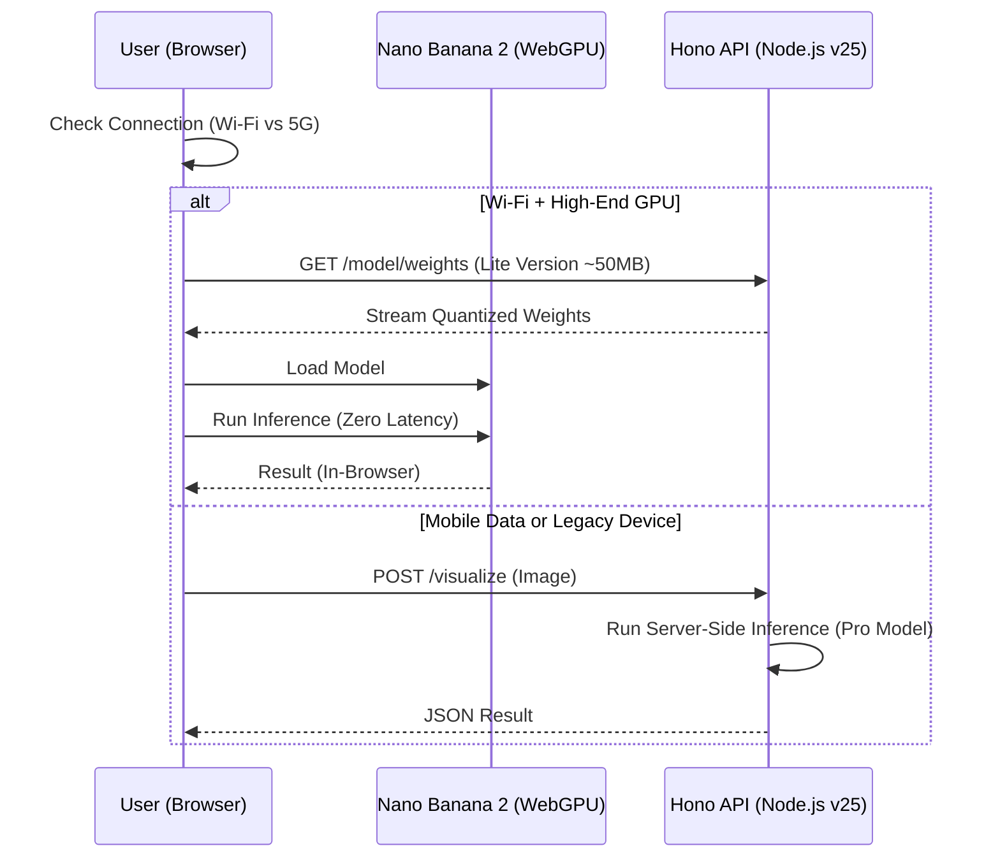

# Jules Handoff: Universal Garage Door Index API

**Status:** Ready for Implementation
**Target:** `apps/api` (Hono Service)
**Context:** Late 2025 Bleeding Edge Stack

## Objective
Build the **Universal Garage Door Index**, a high-performance API that serves garage door metadata and powers the "Instant-View" Visualizer using **Nano Banana 2 Pro**.

## Tech Stack & Architecture
*   **Monorepo:** Turborepo (Root)
*   **API Framework:** **Hono** (v4+) running on **Node.js v25**.
*   **AI Model:** **Nano Banana 2 Pro** (Multimodal).
*   **Inference Strategy:** **Hybrid AI** (Client-First).
    *   **Primary:** WebGPU (Client-side) for zero-latency.
    *   **Fallback:** Server-side inference via Hono for legacy devices.

### System Architecture

```mermaid
graph TD
    subgraph Monorepo [Turborepo Monorepo]
        subgraph Web [apps/web]
            NextJS[Next.js 16 Client]
            WebGPU[Nano Banana 2 (WebGPU)]
        end
        
        subgraph API [apps/api]
            Hono[Hono Service]
            VectorDB[(In-Memory Vector DB)]
            ServerAI[Server-Side Inference]
        end
        
        subgraph Shared [packages/ui]
            UI[Tailwind v4 Components]
        end
    end
    
    User((User)) --> NextJS
    NextJS --> UI
    NextJS -- REST/JSON --> Hono
    Hono --> VectorDB
    
    %% Hybrid AI Flow
    WebGPU -.->|Load Lite Weights (~50MB)| Hono
    Hono -.->|Fallback/Mobile Inference| ServerAI
```

### Inference Flow (Hybrid AI with Smart Loading)



## Implementation Steps

### 1. Data Layer (`apps/api/src/data`)
Create a lightweight, in-memory data store (for prototype speed) with vector embeddings support.

```typescript
// apps/api/src/data/doors.ts
export const doors = [
  {
    id: 'amarr-classica-3000',
    manufacturer: 'Amarr',
    model: 'Classica 3000',
    style: 'Carriage House',
    material: 'Steel',
    r_value: 13.35,
    image_url: 'https://assets.amarr.com/classica-3000.jpg',
    // Pre-computed embeddings for Nano Banana 2 semantic search
    embedding: [0.023, -0.12, ...] 
  },
  // ... more doors
]
```

### 2. API Endpoints (`apps/api/src/index.ts`)
Implement standard REST endpoints using Hono's bleeding edge syntax.

*   `GET /doors`: List all doors with pagination and filtering.
*   `GET /doors/search`: Semantic search using vector embeddings (Nano Banana 2).
*   `GET /doors/:id`: Detailed specs.
*   `GET /model/weights`: Serve the quantized Nano Banana 2 Pro model weights to the client.

### 3. AI Integration: "Instant-View" Visualizer
**Client-Side (Web):**
The frontend will use the experimental `navigator.gpu` API to run the model.

```typescript
// apps/web/src/ai/visualizer.ts
import { NanoBanana2 } from '@google/nano-banana-2-webgpu'

export async function inpaintGarageDoor(image: Blob, doorId: string) {
  // 1. Check for WebGPU support
  if (!navigator.gpu) {
    return fallbackToServer(image, doorId)
  }

  // 2. Load model weights from our API
  const model = await NanoBanana2.load('http://localhost:3001/model/weights')

  // 3. Run inference (Zero Latency)
  return model.inpaint(image, { prompt: `garage door style ${doorId}` })
}
```

**Server-Side (API Fallback):**
If client GPU is insufficient, the API handles the request.

```typescript
// apps/api/src/routes/visualize.ts
import { NanoBanana2 } from '@google/nano-banana-2-node'

app.post('/visualize', async (c) => {
  const body = await c.req.parseBody()
  const image = body['image']
  // Run inference (slower, costs money)
  const result = await NanoBanana2.run(image)
  return c.json(result)
})
```

## Next Actions for Jules
1.  Populate `apps/api/src/data/doors.ts` with real manufacturer data.
2.  Implement the `GET /doors` and `GET /model/weights` endpoints in Hono.
3.  Set up the `@google/nano-banana-2-node` dependency (mocked for now if not available).
